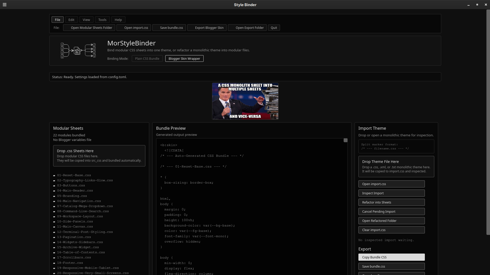

# MorStyleBinder

MorStyleBinder is a lightweight desktop workbench for binding modular CSS sheets into one theme, or refactoring a monolithic Blogger/Tumblr/SpaceHey-style theme into modular files.

It is built for theme workflows where one huge stylesheet becomes hard to edit, review, reuse, or safely paste back into a platform like Blogger.

## Screenshot



---

## ⚠️ Critical Rule: Section Naming (.css Extension)

When splitting a monolithic sheet into modular parts, **every split marker must contain a valid file name ending exactly in `.css`**.

The refactoring engine scans block comments specifically looking for a text token with a `.css` extension. If a section is labeled without `.css`, the engine will not match it, and that code block will accidentally spill into the preceding module.

### How the Engine Maps Chunks

```text
/* --- 01-reset.css --- */      ──> Creates file: src_css/01-reset.css
* { box-sizing: border-box; }

/* --- 02-header --- */         ──> INVALID (No .css extension!)
header { display: flex; }          Appends text directly into 01-reset.css

/* --- 03-footer.css --- */     ──> Creates file: src_css/03-footer.css
footer { display: block; }
```

### Supported Split Marker Formats

The engine is highly tolerant of comment styles, provided the `.css` extension is present:

- `/* --- 01_base.css --- */` — canonical format
- `/* SECTION: 04-Main-Header.css */`
- `/*Root-Section.css */`
- `/* === 01-reset.css === */`

---

## What it does

MorStyleBinder helps with both directions of a theme workflow:

```text
many readable CSS files → one exportable theme bundle
```

and:

```text
one large theme file → many readable CSS files
```

The app can:

- Read modular `.css` sheets from `src_css/`
- Generate a live bundle preview
- Export a normal `bundle.css`
- Export a Blogger-safe `blogger-theme.xml` using a `<b:skin><![CDATA[ ... ]]></b:skin>` wrapper
- Copy the generated bundle CSS to the clipboard
- Open the export folder so generated files are easy to find
- Inspect a monolithic theme file through `import.css`
- Split a monolithic theme into separate sheets using split markers
- Preview files before writing them
- Warn when refactoring would overwrite existing sheets
- Back up overwritten sheets into `src_css_backup/`

## Current app layout

The desktop UI is arranged as a three-panel workbench:

```text
Modular Sheets | Bundle Preview | Import Theme / Export
```

### Modular Sheets

The left panel shows CSS files currently loaded from `src_css/`. Drop `.css` files anywhere on this panel to copy them into `src_css/` and refresh the live bundle preview.

### Bundle Preview

The center panel shows the generated output matching your layout selections: `Plain CSS Bundle` or `Blogger Skin Wrapper`.

### Import Theme / Export

The right panel handles inspecting/refactoring a monolithic theme into modular sheets, and exporting completed assets back to disk.

## Folder structure

MorStyleBinder expects this basic project layout:

```text
.
├── src_css/
│   ├── 01_base.css
│   ├── 02_links.css
│   └── ...
├── import.css
├── bundle.css
├── blogger-theme.xml
└── src_css_backup/
```

- **`src_css/`**: Main source folder for modular sheets bundled into preview/exports.
- **`import.css`**: The import inbox for monolithic theme CSS before refactoring.
- **`bundle.css`**: The plain CSS production export target.
- **`blogger-theme.xml`**: The Blogger-safe XML skin export target.
- **`src_css_backup/`**: Safe recovery path holding timestamped backups of overwritten files.

## Refactor safety

MorStyleBinder avoids silent destructive writes. When split markers would overwrite existing sheets, the app:

1. Previews the exact files that will be written
2. Lists the specific modules that would be overwritten
3. Changes the action track button to `Overwrite Existing Sheets`
4. Backs up the old versions into `src_css_backup/` automatically upon confirmation

## Development

### Requirements

```text
Rust 2021
Floem 0.2.0 GUI
notify 6.1.1 file watching
walkdir 2.4.0 directory traversal
copypasta 0.10.2 clipboard
```

### Run locally

```bash
cargo check
cargo test
cargo run
```

### Release build

```bash
cargo build --release
```

The release binary will be created under `target/release/`.
